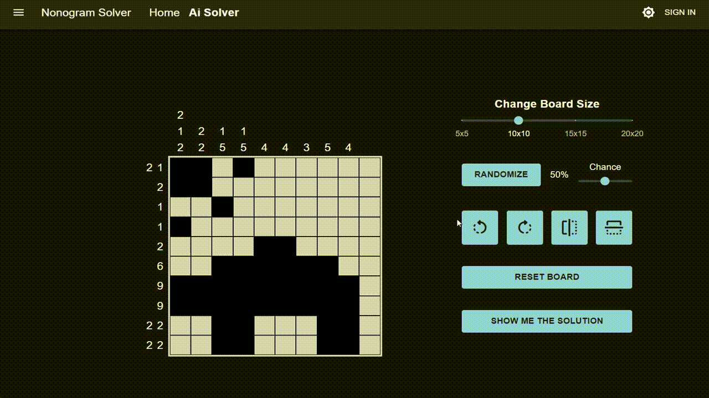

# Nonogram Board Solver

The app lets you create your own Nonogram board and solves it for you with steps.
This project is a remake of my highschool project written in Typescript, React.

## Whats in this app?

The app lets you draw and customize your own board with some utilities:

- Manipulating board size to your choice.

 
 

- Rotating the board 90 degrees either side.
- Flipping the board horizontally and vertically.

 

- Creating random boards with optional black percentage slider.

 

The app makes its own constraints while customizing your board.

When you are done creating, you can let computer solve the board by using its constraints.
The solution has the steps used for the computer to solve the board.

## So, how does it solve?

The algorithm used to solve the board is a backtracking algorithm. I researched the web and combined some of what I found and modified it.

### First step - getting all the solutions for the rows in the board

This is my first modification:

Instead of starting to solve immediately and checking each tile of the board,
the algorithm creates a multi-dimensional array which contains all of the possible solutions for every row.
Each row may have more than 1 solution by itself.

The solutions are created by using only the rows constraints.

### Second step - going through all the possible solutions to complete a board

Now, all left to do is just go through all the row solutions created to complete a board by checking the column constraints.

The algorithm used is Back-tracking. Every step adds a new row solution to the board. If successfully, adds another, otherwise it will back-track to the old board, until the board is complete.

### How are the steps saved?

- The main function of the algorithm creates a snapshot of the board each time a row is added.
- If the row is a success, it adds it a steps array which is displayed later.

However, this got me to some trouble - **THERE WERE SO MANY STEPS**

With a large board, a solution can have more than **10,000,000 steps**, which cost me more memory than I have on my computer!

I had to manage the snapshot to use the lowest amount of memory. Then, I found the **BIT ARRAYS** as a solution.

Because Nonogram boards have only 2 colors, a bit array is the perfect data structure to save a snapshot of the grid.

This exteremely reduced the amount of memory used to solve the large boards.